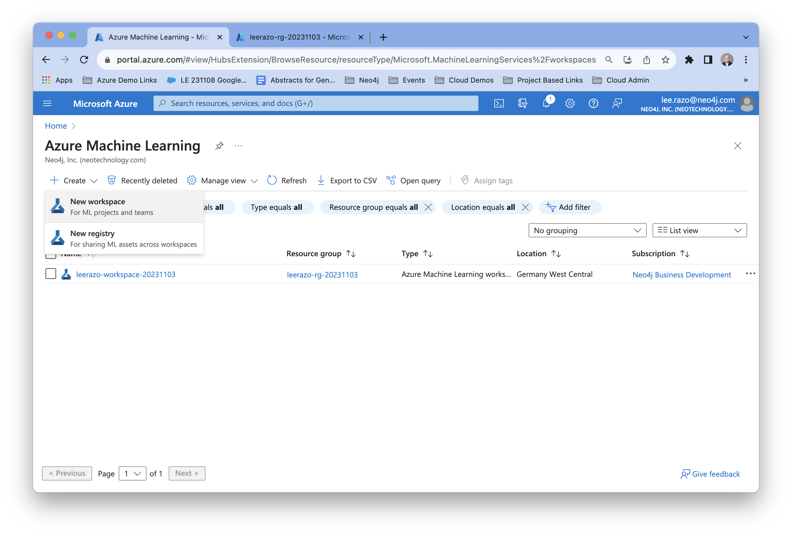
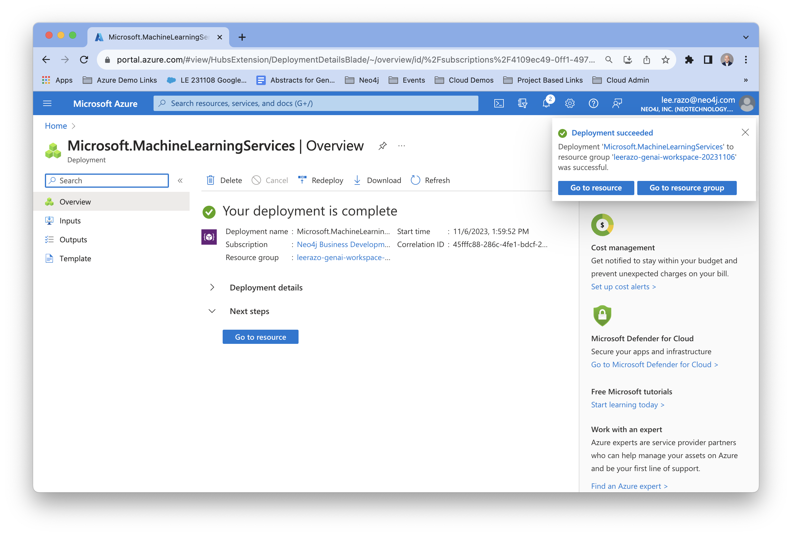
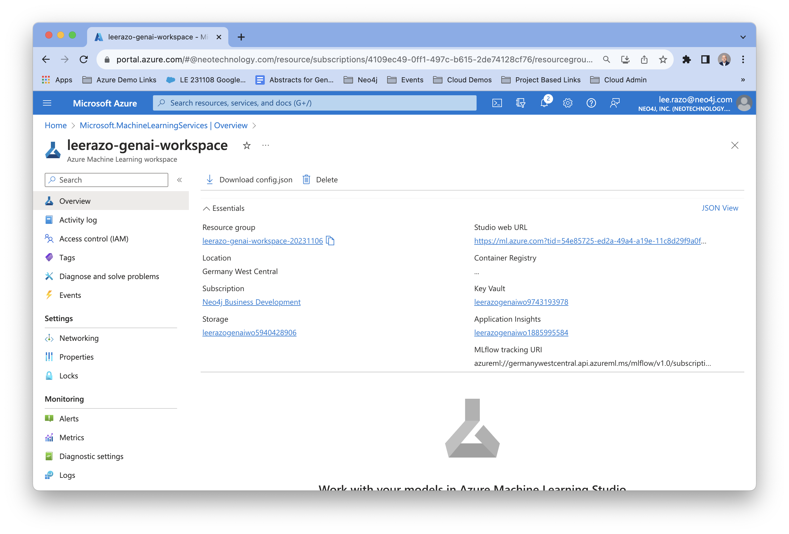
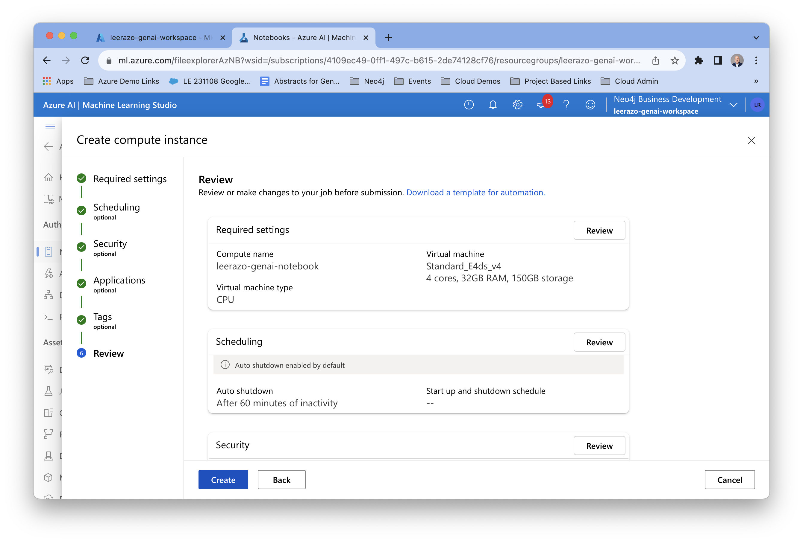
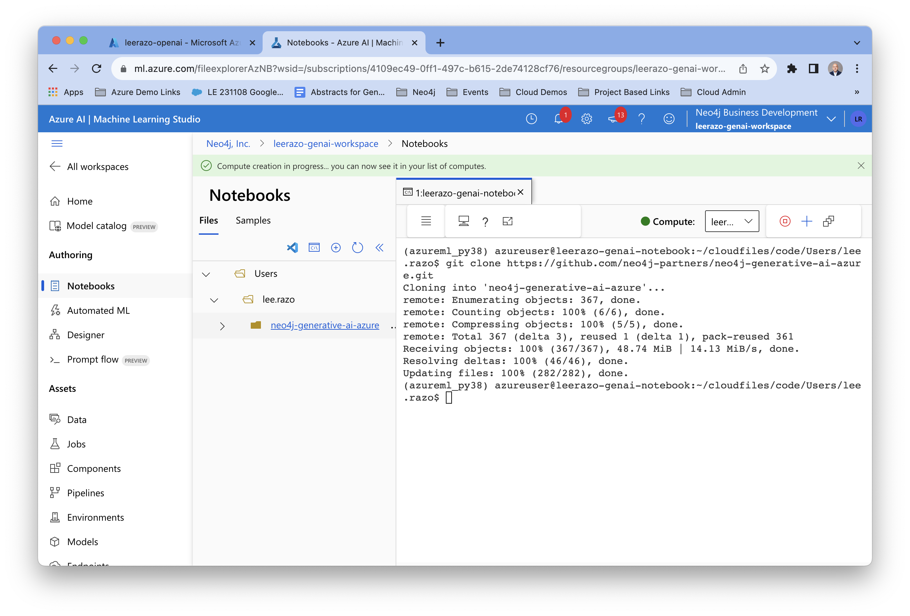

# Set up a Jupyter notebook server using Azure ML Studio 

# Overview
In order to run through this lab, you'll need to set up a notebook server using Azure ML Studio

# Setup

## Create an Azure ML Workspace 

1. **Create an Azure Open AI Workspace**
- Go to the Azure Open AI console from the Azure Portal
- Select "Create"

2. **Choose the resource group you created earlier or create a new one and fill in the required fields**
- Take the defaults for the fields in the rest of the screens and click "Create" 

3. **Go to the resources** 
- Once it's done deploying click on "Go To Resource" 

4. **Go to Azure ML Studio**
- Click on the "Studio Web URL" link on the upper right hand side. 

5. **Go to Notebooks**
- Click on the "Notebooks" link on the left side panel. 

6. **Create a Compute Instance for the Notebook server**
- Click on the blue "Create Compute" link on the lower right of the screen. 

7. **Configure and Create Instance**
- Give the instance a name and click "Create". 

8. **Start a Terminal session**
- Click on the blue "Terminal" button on the lower right. 

9. **Clone this Github repository onto the notebook instance**
- Once the compute instance has finished deploying, you will see a terminal prompt. Clone this repository using the following command: 

    git clone https://github.com/neo4j-partners/neo4j-generative-ai-azure.git

10. **Enter API and Neo4j authentication details into config.env file**
- Once the cloning is complete navigate into the repository and rename the file 'ingestion/config.env.example' to 'config.env'. Then open the file and fill in the fields with the OpenAI API details and the Neo4j database access and authentication details. 

- Note: for OPEN_API_VERSION, use "2023-03-15-preview"

Now you're ready to begin using the notebook. 